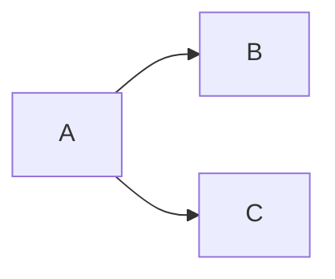

## 対象読者
gitの操作を一通り触ってみたぐらいの初級者向け

## `git commit --amend`はコミットメッセージの修正だよね？
`--amend`オプションを付けることによって、直前のコミット（HEADポインタがあるコミット？）のコミットメッセージの修正を行うことが出来ます。これは、調べたら直ぐに出てきて、gitを少し触ったことがある人以上であれば周知の事実だと思います。しかし、これには、前提条件が隠されています。

## 前提条件とは

- ローカルリポジトリからプッシュしていない

これです。
当たり前かもしれないですが、`git commit --amend`はプッシュ済みのコミットは直せません。`git commit`のオプションだからですね。ローカルリポジトリのコミットを変更するものですので、リモートリポジトリにあるコミットはこのコマンドでは修正できません。最後にプッシュ済みのコミットの修正についても書きます。

## ローカルリポジトリからプッシュした後にするとどうなるのか
ローカルリポジトリからプッシュをして、ローカルとリモートの状態を最新状態で一致させてから、`git commit --amend`を行うと、HEADポインタの一つ前の親コミットから分岐してdetached HEADの状態として新たなコミットが生成されます。detached HEADについては、話すと長くなりそうなので参考文献[^1]を参照してください。簡単に言うと、ブランチ上からは見えないコミットになっていて移動したときにコミットを扱えないよ、という状態になっています。
話を戻すと、ローカルとリモートリポジトリの状態が、`A`の状態から`B`というコミットをして、

となっているとします。ここで、`B`のコミットメッセージを修正したいと思って、`git commit --amend`とすると、

というように、`B`のコミットを修正したいのに`A`から派生されて`C`のコミットが作られてしまいます。

## 

[^1]: https://qiita.com/tikamoto/items/3019b6703681c426b850