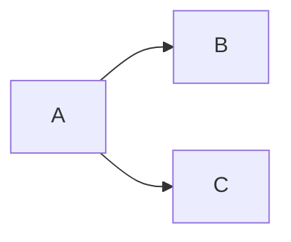

## 対象読者
gitの操作を一通り触ってみたぐらいの初級者向け

## `git commit --amend`はコミットメッセージの修正だよね？
`--amend`オプションを付けることによって、直前のコミット（HEADポインタがあるコミット？）のコミットメッセージの修正を行うことが出来ます。これは、調べたら直ぐに出てきて、gitを少し触ったことがある人以上であれば周知の事実だと思います。しかし、これには、前提条件が隠されています。

## 前提条件とは

- ローカルリポジトリからプッシュしていない

これです。
当たり前かもしれないですが、`git commit --amend`はプッシュ済みのコミットは直せません。`git commit`のオプションだからですね。ローカルリポジトリのコミットを変更するものですので、リモートリポジトリにあるコミットはこのコマンドでは修正できません。最後にプッシュ済みのコミットの修正についても書きます。

## ローカルリポジトリからプッシュした後にするとどうなるのか
ローカルリポジトリからプッシュをして、ローカルとリモートの状態を最新状態で一致させてから、`git commit --amend`を行うと、HEADポインタの一つ前の親コミットから分岐してdetached HEADの状態として新たなコミットが生成されます。detached HEADについては、話すと長くなりそうなので参考文献[^1]を参照してください。簡単に言うと、ブランチ上からは見えないコミットになっていて移動したときにコミットを扱えないよ、という状態になっています。
話を戻すと、ローカルとリモートリポジトリの状態が、`A`の状態から`B`というコミットをして、

となっているとします。ここで、`B`のコミットメッセージを修正したいと思って、`git commit --amend`とすると、

というように、`B`のコミットを修正したいのに`A`から派生されて`C`のコミットが作られてしまいます。このままプッシュしても、Gitからは「リモートリポジトリの方が先に進んでいて、履歴が違うからmergeするなりしてどうにか直してね」と言われます。

## リモートリポジトリにプッシュ後のコミットの修正方法
主に二つあると思っていますが、コミットメッセージの修正のみであれば変な事書いていない限り修正する必要はないと思います。
一つ目は、`git reset`をして戻ってから修正して、`git push --force`をすること。これは、コミット履歴を強引に書き換えるので他の人が`git pull`でPCに既にコミットを取り込んでいたらコンフリクトの原因となります。なるべくしないようにしましょう。
二つ目は、`git revert`で、コミット内容を打ち消すためのコミットを生成します。`git reset`との違いは、コミット履歴を破壊するかしないかです。本当に修正したければ、こちらを使うと良いでしょう。
ちなみに、`git reset`のオプションには三種類あって、--soft,--mixed,--hardとあり、それぞれHEADの位置（作業する位置）とステージング環境と作業ツリーが変更されます。詳しくはこちら[^2]を参照してください。

## 最後に
自分もこの記事を書きながら、`--amend`を打つとなぜ一つ前の親コミットから派生するのか分かっていません。どなたか分かる方いれば、PRかコメントで教えてください。
gitのコマンドを打つときには、作業環境に何のファイルがあるのかや前提条件をしっかり確認しながら使いましょう。特に、--forceや--hardなどのオプションを使う時にはいつも以上に環境に何があるのかを確認しましょう。初級者の頃は、作業ツリーとステージング環境とローカルリポジトリ、そしてリモートリポジトリの状態を見ながら一つずつ理解するといいかもしれませんね。壊しながら学べるようなリポジトリを作るのもお勧めです。

[^1]: https://qiita.com/tikamoto/items/3019b6703681c426b850
[^2]: https://www.r-staffing.co.jp/engineer/entry/20191129_1